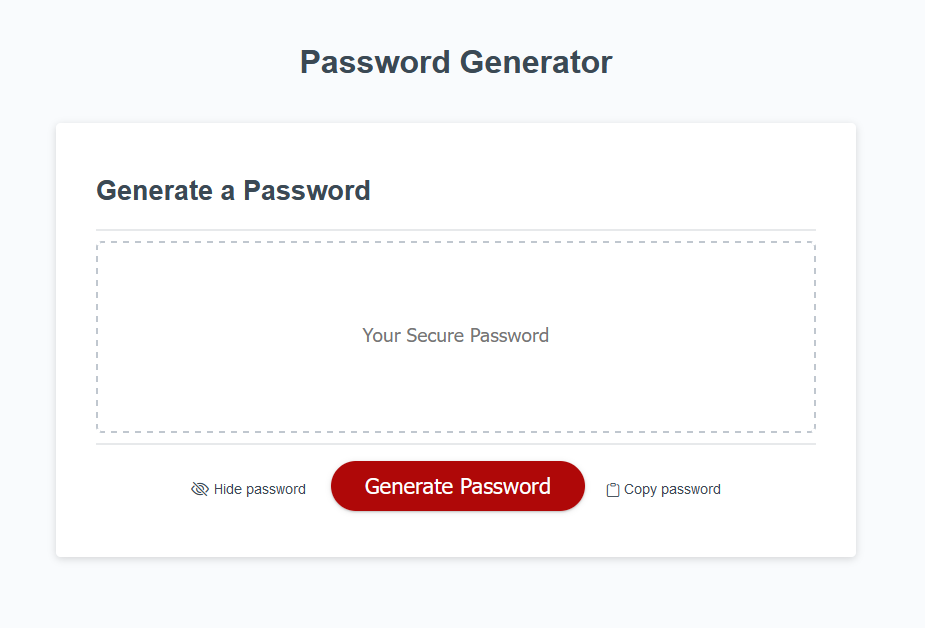

# Password-Generator

## Module 5 Challenge - Intermediate JavaScript: Password Generator

###  Preliminary notes - index.html and styles.css

<ol>

<li>I validated the provided HTML (<code>index.html</code>) with the <strong>W3C Validator</strong> - <a href="https://validator.w3.org/">https://validator.w3.org/</a> - there were no errors or alerts.  </li>

In subsequent checks, validation showed an error caused by incorrectly writing <code>input type = “type”</code>. I fixed this by correcting the error – <code>input type=”text”</code>. This had not prevented the app from working for me but, of course, it could have cause difficulties for other users. 

So, validation is a helpful proofing tool. 

With all my changes, it still validated without errors or alerts.  </li>

<li>The <strong>WebAim/WAVE</strong> <a href="https://wave.webaim.org/">https://wave.webaim.org/</a> tool passed the original HTML (<code>index.html</code>) with no errors or alerts   

Subsequently, with my changes, it gave two alerts (orphaned form labels). &lt;label for = “”&gt; would not be valid here because the i elements are not form elements (even if placed within &lt;form&gt;&lt;/form&gt; tags). However, for accessibility, there is text accompanying the icons, and these were alerts not errors.  </li>

<li><strong>CSS Validation</strong> <a href="https://jigsaw.w3.org/css-validator/"> https://jigsaw.w3.org/css-validator/</a> threw an error for <code>style.css</code> -
     <pre>  .btn 	Too many values or values are not recognized : 
     rgb(0, 0, 0, 0.1) 0 1px 6px 0 rgb(0, 0, 0, 0.2) 0 
     1px 1px 0 </pre>

Was this error because the CSS validator has not been updated yet to accept the rgba extension of the rgb color model?    

A Google search found that the code was missing a comma separator between the rgba values of the two shadows https://developer.mozilla.org/en-US/docs/Web/CSS/box-shadow. Once the code was changed, the validator showed no errors or alerts. CSS validation also gave warnings about the vendor expressions <pre>-webkit-appearance</pre> and <pre>-moz-appearance</pre> But as CSS Tricks* pointed out “This (appearance) is starting to be unprefixed, which is great because the cross-browser story here is very complicated.”  </li>

<li>I was curious. Why as it’s called a “secure password” was that there was no “Hide password” password feature in the project requirements as an element of security? I raised this in class, having viewed numerous online “Password Generator” apps that don’t do this. While our instructor, Husman, gave a good explanation, once I completed the required project tasks I thought I’d include a “hide password” feature anyway – just in case someone would be looking over your shoulder while you were using the app and, also, I liked the eye open and shut icons. What the other Password Generators did include was a copy feature. So, I thought, I'll have that too with a clipboard icon grabbed from the same content delivery network (CDN).  </li>

<li>Finally, the html page looked strange having a form element (button) but not the container tags &lt;form&gt;&lt;/form&gt; even though the code validated. So, to give the page more structure, I added them. I also removed a extraneous &lt;div&gt;&lt;div&gt; replacing it with &lt;main&gt;&lt;main&gt; I then changed my mind and removed the form tags, as the form element (container) reduced the space available for the inline icons thereby squeezing them out of shape. </li>
</ol>

---

### Coding "user interaction" first - script.js
<ol>
<li>Early on in the project, I removed the line breaks from the the four <strong>character set arrays</strong>. While VSCode allowed me to collapse them, they didn’t stay that way, and scrolling and scrolling past them became tedious.  

I changed the <code>var</code> variable to const for arrays and other variables that do not change, and let for those variables such as the string <code>password</code> that are expected to change. Const and let had their scope restrictions but I think it makes for more robust code.</li>

<li>I began coding the user interaction, first for the length they wanted for the password, with a <code>confirm</code> and a <code>prompt</code> message(popups/modals), and validating their input using <strong>if statements</strong>, and <strong>error handling</strong>.  </li>

<li>When the user clicks the <code>Generate Password</code> button, the function <code>GetPasswordOptions</code> is called and a <code>confirm</code> modal (<code>askUser</code>) is presented to the user.  </li>
<li>If the user presses cancel on the first <code>confirm</code> modal (askUser), an <code>alert</code> is triggered with the message: <em>"Looks like you don't want to continue. Come back when you'd like to continue. Bye."</em>. The app is then exited (returned false from the function).  </li> 
<li>If the user selects ok, a <code>prompt</code> modal is then presented with the request <em>"Select the password length you require - it must be from 8 to 128 characters."</em> If the user selects cancel, they are given two more chances and then an <code>alert</code> (bye) is triggered with the message: <em>"Looks like you don't want to continue. Come back when you'd like to continue. Bye."</em>. The app is then exited (returned false from the function).  </li>

<li>If the user selects a value, an if statement is used to validate their choice. If the value is a letter(<code>char</code>) or <code>string</code>, or the <code>number</code> they give is less than 8 or greater than 128, they given two more changes to make the correct choice. If at the third option they don’t give the correct value or select cancel, then an <code>alert</code> (bye) is triggered with the message: <em>"Looks like you don't want to continue. Come back when you'd like to continue. Bye."</em>. The app is then exited (returned false from the function).  </li>

<li>A lot of toing and froing, of course I wasn't getting it right. However, I had booked a edx tutor to help me with debugging. And he was very helpful. He also recommended using <code>return false</code> rather than simply <code>return</code> to get out of the function – <em>“The 'return false' statement is often used in programming to indicate that a certain condition has not been met. It is a way of telling the program to stop executing the current code and return a false value.”</em>  

It was a good boast for me to dig deeper into debugging. I spent a lot of time in Chrome browser iterating through the functions following the variable changes (or not), setting up <strong>breakpoints</strong> and <strong>watches</strong>, thereby eventually identifying the problem. This was very helpful, along with a lot of Googling. I have a lengthy list of sources.  </li>

<li>It was somewhat complicated collecting the user preferences for the character sets to include in the password. I decided to create a separate temporary function named <code>moreOptions</code> to handle this with the <code>pwdLength</code> variable passed to it.  </li>

<li>I determined that from the <code>getPasswordOptions</code> function, I was calling the <code>getMoreOptions</code> function which had not yet been declared, and because function expression used a <code>const</code> variable, it could not be <strong>“hoisted”</strong>. I reworked the functions – refactoring the code to move the call from <code>passwordOptions</code> to <code>moreOptions</code>. This resolved the no-hoisting problem.  </li>

<li>Incorporating the <code>getMoreOptions</code> into <code>getPasswordOptions</code>, as well as making <strong>local</strong> variables used in multiple functions that pointed to the same data, <strong>global</strong>, I was able to iron out some thorny issues.  </li>

<li>Eventually, I merged the two functions. The <code>moreOptions</code> funcion was only meant to be temporary.  </li>
</ol>

---

###  My cryptic notes - script.js

My notes became rather cryptic as I proceeded. For example:

<pre>    Changed the variable declaration of generateBtn from
         let to const since the variable doesn't need to be reassigned.

    To do – fix the options loop

    Get the committed function from gitHub

    messages in variable form

    why the bye message 2x?

    avoid nested functions and multiple for loops

    added type=button

    form?

    Still getting rid of multiple byes

    Global variables for now – as the object and arrays are not 
        playing nicely

    Filter?

    Add visibility toggle – difficult on textarea attribute

    None of them (Password Generator websites) have visibility toggle 
        – with eye icon?

  From class:
            
    This refers to the object that it is inside of – this points
        to itself

    Root object (window object) in JavaScript

    Alert()  js looks at the global object – window.alert

    Find() takes a function

    Filter works in the same way as find 
    
</pre>

---

### Once the user has decided, creating an object - script.js

<ol>
<li>The creation of the <code>optionsObj</code> (<strong>object</strong>) presented another set of challenges, which were resolved by tenacious debugging and variable watches.  </li>

<li>Having successfuly obtaining a valid password length from the user, the user is then presented with a series of <code>confirm</code> modals. If the user does not select any of these options, they are given another change. This time, a <strong>while loop</strong> was used, which would continue indefinitely. So, to allow an escape from the that loop - apart from providing at least one option, a message was given in the <code>confirm</code> model, which appeared when no choice was made, that they could select <code>cancel</code> to stop the program - then the <code>alert</code> message modal and <code>return false</code>, as before.  </li>

<li>I tried first to declare and initialise the object with the <code>objlength</code> property. It was misbehaving so I  changed tack, and declared and initialized the object further down with the options specialChars, numbers, lowerCase and uppercase options. I used an “object literal” to create the object using an ES6 shorthand syntax - instead of explicitly assigning values to properties I directly used variable names as property names. I then added the <code>objLength</code> with the value selected by the user. That was the easy part. Trickier was moving it about throughout the function and to other functions. I tried to use local variables, but it just wasn’t happening so I opted for a global variable.  </li> 
</ol>

---

###  Generating random characters and, from them, the password - script.js
<ol>
<li>The <code>getRandom</code> and <code>generatePassword</code> functions involved a set of different issues. In the second of these functions, the <code>password</code> string and <code>charsToUse</code> array are first initialized as empty, again to ensure that previous options don’t reappear. Then the object is acted upon using the <strong>"for in” loop</strong> and a <strong>switch statement</strong> and <strong>spread syntax</strong> to pull out the user-selected character set(s) from the object. In turn, if the <strong>object's property value</strong> is <code>true</code>, the corresponding array(s) is/are then pushed to the <code>charsToUse</code> array  </li>

<li>Then, with a function expression, there is a call to the first function. In <code>getRandom()</code>, the global variable is initialized as an empty array – (otherwise, in subsequent program starts, previously selected values reappear). The two local variables are declared and initialized as empty. In a <strong>for loop</strong> which iterates up to the selected length of the the password, random characters derived from the selected character sets are created using the <strong>Math.floor and Math.random construction</strong>. A <code>randomIndex</code> array is then created. The randomly selected character is then pushed into the <code>randomChars</code> array. Using the join method the randomChars is then returned to the generatePassword function where it is assigned to the password variable.

* Debugging in Chrome became ghost busting!  </li>
</ol>

---

###  Generating random characters and, from them, the password - script.js, index.html and style.css

<ol>
<li>Having got the essentials working – a password taking into account the user-decided length and random characters derived from a the user-chosen character set(s) - I turned to that old bugaboo of a hide password feature with the open and shut eye icon. And I decided to add a copy icon to facilitate the user in getting the password - especially if it could be 228 characters long! These websites provided useful templates.  
<ul>
<li>How TO - Toggle Password Visibility - <a href="https://www.w3schools.com/howto/howto_js_toggle_password.asp">https://www.w3schools.com/howto/howto_js_toggle_password.asp</a></li>
<li>How to Toggle Password Visibility - <a href="https://www.javascripttutorial.net/javascript-dom/javascript-toggle-password-visibility/">https://www.javascripttutorial.net/javascript-dom/javascript-toggle-password-visibility/</a></li>
<li>How TO - Copy Text to Clipboard - <a href="https://www.w3schools.com/howto/howto_js_copy_clipboard.asp">https://www.w3schools.com/howto/howto_js_copy_clipboard.asp</a></li>
<li>Select and Copy input text onclick? - <a href="https://stackoverflow.com/questions/36210862/select-and-copy-input-text-onclick">https://stackoverflow.com/questions/36210862/select-and-copy-input-text-onclick</a></li>
</ul>

And the open eye, shut eye, and clipboard icons were pulled from https://www.jsdelivr.com/ a content delivery network (CDN).

   
     
> The HTML page has an  input element with the type password and an &lt;i&gt; element with the CSS classes provided by Bootstrap CSS.
> The Bootstrap CSS allows you to use the class bi-eye of the &lt;i&gt; element to show the eye icon. To change the icon from eye to eye slash, you just need to change the class of the &lt;i&gt; element to bi-eye-slash.
-- "How to Toggle Password Visibility"
 </li>

<li>I added the following style sheet in the head of the html page – 
&lt:link rel="stylesheet" href="https://cdn.jsdelivr.net/npm/bootstrap-icons@1.3.0/font/bootstrap-icons.css" /&gt;  </li>

<li>I used an <strong>event listener</strong>, and a <strong>ternary operator</strong> to get the toggle (hide/show).  </li>

<li>For the copy password feature I again used an <strong>event listener</strong>, a <strong>select function</strong> and the <strong>copy action of the Web API `document.execCommand('x')`</strong> to copy the selected password string.  </li>

<li>In the html, to make these features accessible, I added a text description beside the icon. Including a label has allowed the accompanying text to be clicked as the icon - thereby extending the clickable area and enhancing its accessibility.</li>
</ol>

---

###  Screenshot, web page and online references

Here's a screenshot of index.html and the link to the webpage - https://stephdavid.github.io/Password-Generator/
 

References used include: 

Object methods, "this"
https://javascript.info/object-methods 

Specify Button Type
https://webhint.io/docs/user-guide/hints/hint-button-type/ 

Never forget type="button" on generated buttons!
https://lea.verou.me/blog/2018/05/never-forget-typebutton-on-generated-buttons/ 

When and why to ‘return false’ in JavaScript?
https://www.geeksforgeeks.org/when-and-why-to-return-false-in-javascript/ 

querySelector() vs. getElementById()
https://dev.to/colelevy/queryselector-vs-getelementbyid-166n 

Array.prototype.forEach()
https://developer.mozilla.org/en-US/docs/Web/JavaScript/Reference/Global_Objects/Array/forEach 

Array.prototype.join()
JavaScript MDN
https://developer.mozilla.org/en-US/docs/Web/JavaScript/Reference/Global_Objects/Array/join 

Chrome violation : [Violation] Handler took 83ms of runtime
https://stackoverflow.com/questions/42218699/chrome-violation-violation-handler-took-83ms-of-runtime 

How to Check if an Object is Empty in JavaScript – JS Java isEmpty Equivalent
https://www.freecodecamp.org/news/check-if-an-object-is-empty-in-javascript/ 

&lt; input type="password"&gt;
https://developer.mozilla.org/en-US/docs/Web/HTML/Element/input/password 

An accessible toggle
https://kittygiraudel.com/2021/04/05/an-accessible-toggle/#button-variant 

7 ES6 Patterns Every JavaScript Developer Should be Familiar With
https://medium.com/@Evelyn.Taylor/7-es6-patterns-every-javascript-developer-should-be-familiar-with-f24578d4b6ad 

JavaScript: How to Loop over Objects
https://blog.stackademic.com/javascript-how-to-loop-over-objects-735b0bf42e11 

JavaScript variables
https://blog.devgenius.io/javascript-variables-a4424b9784b4 

querySelector vs. getElementById: A Comparison
https://careerkarma.com/blog/javascript-queryselector-vs-getelementbyid/ 

How TO
Copy Text to Clipboard
https://www.w3schools.com/howto/howto_js_copy_clipboard.asp 

Conditional (ternary) operator
https://developer.mozilla.org/en-US/docs/Web/JavaScript/Reference/Operators/Conditional_operator 

appearance
https://css-tricks.com/almanac/properties/a/appearance/ 

CSS Appearance
https://caniuse.com/css-appearance 

HTML form tag with no attributes
any reason not to?
https://stackoverflow.com/questions/9284649/html-form-tag-with-no-attributes-any-reason-not-to 

Difference between let and var in JavaScript?
https://codedamn.com/news/javascript/difference-between-let-and-var-in-javascript 

Math.random and Math.floor explained
https://www.codecademy.com/forum_questions/50c386a4a122749bc1006ca6 

“this” in Javascript
https://medium.com/stackademic/this-in-javascript-3e3a8da93aac 

Why Functional Programming Is Like a Superpower for developers
https://medium.com/@cannon_circuit/why-functional-programming-is-like-a-superpower-for-developers-61c0c6c64617 

TL:DR i.e. a rabbit hole
Higher Order Functions in JavaScript – Explained with Practical Examples
https://www.freecodecamp.org/news/higher-order-functions-in-javascript-explained/ 

Debugging in VSCode
https://code.visualstudio.com/docs/editor/debugging 

6 Debugging Code Visual Studio Code
https://learning.oreilly.com/library/view/visual-studio-code/9781119588184/c06.xhtml 

Debug JavaScript
https://developer.chrome.com/docs/devtools/javascript/ 

How to display HTML tags as plain text in HTML
https://www.geeksforgeeks.org/how-to-display-html-tags-as-plain-text-in-html/ 

Basic writing and formatting syntax(GitHub Markdown)
https://docs.github.com/en/get-started/writing-on-github/getting-started-with-writing-and-formatting-on-github/basic-writing-and-formatting-syntax 

GitHub Flavored Markdown Spec
https://github.github.com/gfm/ 

About writing and formatting on GitHub
https://docs.github.com/en/get-started/writing-on-github/getting-started-with-writing-and-formatting-on-github/about-writing-and-formatting-on-github 

Working with advanced formatting
https://docs.github.com/en/get-started/writing-on-github/working-with-advanced-formatting 

Quickstart for writing on GitHub
https://docs.github.com/en/get-started/writing-on-github/getting-started-with-writing-and-formatting-on-github/quickstart-for-writing-on-github 

Markdown: Syntax
https://daringfireball.net/projects/markdown/syntax 
